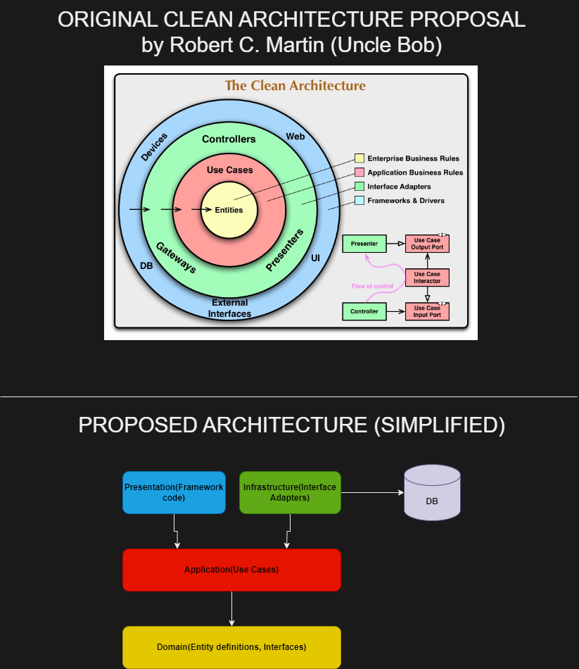
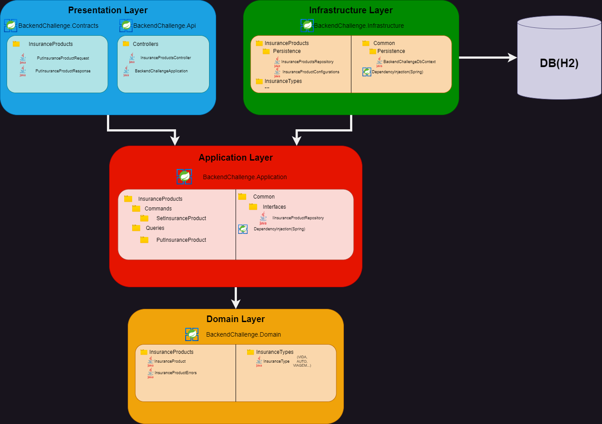

# Clean Architecture Backend Challenge

## Instruções
### Executando este projeto
IMPORTANTE: Para execução desse projeto, é necessário ter o Docker instalado! Este projeto sobe uma instância um container com Zipkin via Docker Compose.

A classe com o método "main" dessa aplicação pode ser encontrada em "backendchallenge-presentation/src/main/java/br/com/vilevidya/BackendChallengeApplication.java".

Suba a aplicação BackendChallengeApplication na sua IDE de preferência ou pelo "mvn spring-boot:run"

Uma vez que a aplicação estiver online, você pode ouví-la na porta 8080. O endpoint separado para o teste é o caminho PUT /produtos.

Há uma collection do Insomnia do caminho assets/collection_insomnia.json

O Zipkin pode ser acessado em http://localhost:9411/zipkin/

O H2 console pode ser acessado em http://localhost:8080/h2-console/

## Sobre a solução
### Clean Architecture Base
Este projeto foi desenvolvido usando "The Clean Architecture", originalmente escrita por Robert C. Martin (Uncle Bob) e você pode conferir o texto na íntegra [em seu blog](https://blog.cleancoder.com/uncle-bob/2012/08/13/the-clean-architecture.html).

Abaixo uma imagem comparando a proposta de Robert versus a minha proposta de arquitetura deste projeto.

### Clean Architecture Detalhe
Abaixo está um diagrama com uma estimativa do detalhe de como cada layer da arquitetura ficará ao final do projeto. Recomendo comparar o diagrama com a estrutura final do projeto.

Obs.: eu esbocei esse diagrama nas primeiras horas que eu recebi o teste e eu vou manter neste estado inicial pra ilustrar o entendimento inicial e a evolução do projeto durante a execução.

#### Presentation Layer
No nosso projeto, esta camada irá conter classes que nos ajudarão a lidar com HTTP(Request/Response) e código de framework(spring-starter-web, actuator, validator, aop, zipkin). Trata a requisição e delega para a camada de Application via UseCase a fim de receber uma response.

#### Infrastructure Layer
Esta camada terá a responsabilidade de manter os Interface Adapters(DBContext, Repository) longe das outras camadas. No nosso caso, essa camada expõe uma interface para a camada de Application, que recebe sua implementação por injeção de dependência.

#### Application Layer
Esta camada manterá os "Use Cases" separados da camada de Domain. Um Use Case é a representação de um fluxo específico do negócio. É onde as regras de negócio serão processadas. Traduzindo, é um caso de uso.

#### Domain Layer
Por último, esta camada irá conter as definições de negócio.

### Clean Architecture No Projeto
#### Multi-module
Este projeto está estruturado em um esquema maven multi-module, que consiste na existência de um pom.xml parent e um pom.xml para cada module(child).
O intuito é fazer, de forma estrutural, com que as camadas tenham apenas o acoplamento correto, reforçando a "The Dependency Rule" do conceito da Clean Architecture, onde dependências de código fonte só podem apontar "pra dentro"(vide as setas na imagem da proposta original do Clean Architecture). Ao revisar o código deste repositório, você pode perceber a regra é reforçada em cada módulo por meio da tag <dependency> em seus pom.xml.

Para que isso seja possível, o pom.xml parent precisa carregar todos os módulos na tag <modules> em seu pom.xml

#### Separação de responsabilidade
O ciclo de vida de uma chamada à esta aplicação respeita a ordem do Clean Architecture, fazendo o seguinte caminho.

Presentation ->(-> Infrastructure injetando as implementações dos "Gateways" da Application, servindo como Interface Adapters ->)Application -> Domain

Presentation <- Application (<- Infrastructure retornando o resultado do comportamento implementado <-)<- Domain

### Funcionalidades
#### Salva & Atualiza Produtos de Seguros
PUT /produtos é o endpoint exposto para inserção e atualização de um Produto de Seguro. A inserção ou atualização é feita conforme as regras do desafio e o retorno também.
O endpoint também retorna um UUID no campo "id", que também é salvo no banco de dados.

Não entendi muito bem o sentido do UUID, uma vez que ele é um parâmetro opcional na API.
Como ele não é obrigatório na chamada, fiz uma chave composta por "nome" e "categoria" para evitar duplicidade de Produtos de Seguros.

Se você tentar salvar um Produto de Seguro com "nome" e "categoria" igual a um que já existe, a API vai atualizar o registro já existente e vai devolver o UUID que foi salvo na primeira inserção.

#### Busca Categoria de Produto
Este caso de uso não tem um endpoint exposto e serve para realizar uma busca no "catálogo" de categorias de produto e retornar os impostos relacionados à categoria.
Inicialmente eu tinha criado uma entity pra guardar isso no banco de dados mas ficou desnecessário.
Não criei uma Controller para isso porque o desafio não solicita este endpoint mas pode ser facilmente implementado, uma vez que já existe um UseCase com este fluxo.
Por fim, substituí o Repository original que consultava o BD por um Repository local que guarda uma lista estática das categorias e busca a categoria desejada dentro da lista.

#### Observabilidade (métricas, traces e logs)
Este projeto utiliza o Observation API do pacote spring-boot-starter-aop para observar alguns pontos interessantes do projeto e traçar métricas.

Neste projeto, eu estou usando o Zipkin para colher os dados desses métodos. 

O projeto está colhendo os dados de execução da Controller e todos os Use Cases que estão sendo chamados.

Os logs estão formatados e estão sendo logados no console da aplicação e em um arquivo de texto.

É possível realizar o tracing das chamadas da aplicação uma vez que os logs possuem um spanID e parentID.

## Pontos de Melhoria
### Uso de Generics para implementação de comportamento comum
É possível refatorar algumas classes como classes de Response ou Exception para que elas herdem de alguma classe comportamentos comuns.
Existe [este exemplo](https://medium.com/@aedemirsen/generic-api-response-with-spring-boot-175434952086) ilustrando a implementação de Generics para implementar uma "Response" genérica e que pode ser utilizada em conjunto com o ResponseEntity, habilitando também o uso do ExceptionHandler em cima de tudo isso.

### Qualidade dos Testes Unitários
Enxergo que é possível uma melhoria nos testes unitários. Deve haver uma forma mais limpa de escrever os testes aproveitando melhor as bibliotecas de teste.

O código está coeso e seguindo a estrutura Arrange -> Act -> Assert.

Por fim, o coverage está alto e os cenários estão cobertos.

## Considerações Finais
Estou satisfeito com o resultado do projeto.

A arquitetura está bem definida e o código segue os princípios de SOLID.

Está em um estado de "entregue", funcionando e com melhorias mapeadas.

É um bom ponto de partida para uma aplicação e um desenvolvedor com conhecimentos de Clean Architecture consegue identificar a estrutura do projeto com facilidade.
